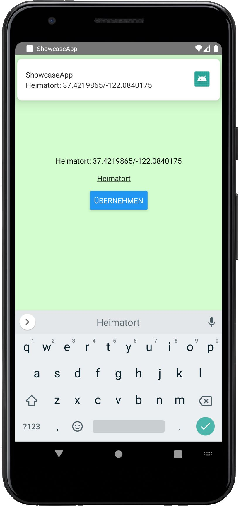

# Rapid Prototyping mit React Native

Dies ist ein einfacher Prototyp mit React Native aus dem dazugehörigen [Artikel](https://www.trion.de/news/2020/05/18/rapid-prototyping-react-native.html). 

# Setup
1. Projekt auschecken: `git clone https://github.com/trion-development/react-native-prototyping.git`
2. React Native CLI installieren: `npm install -g react-native-cli` 
3. Projekt starten: `npx react-native run-android` 

# Demo
